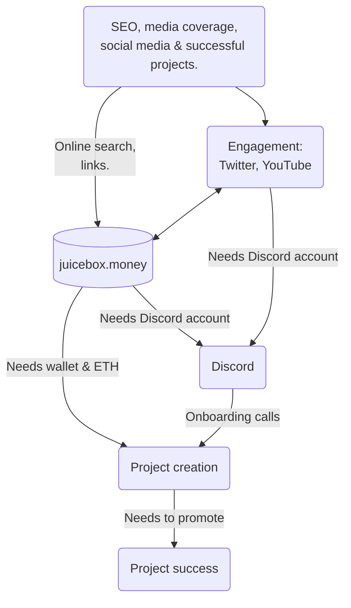
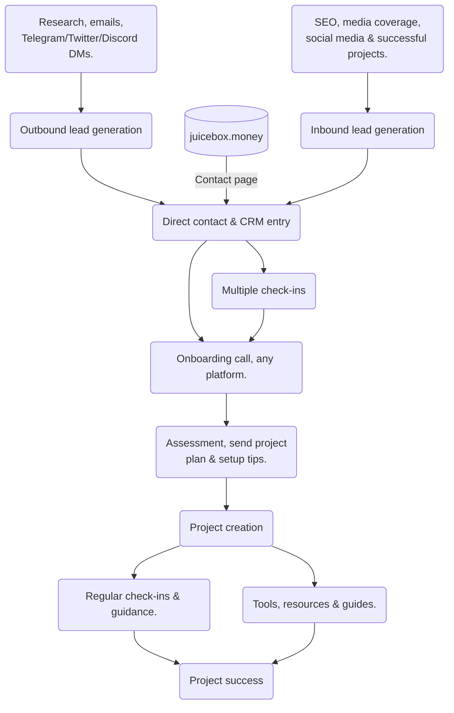

How can we adapt our onboarding process to maximize the number of successful projects on Juicebox?

## Current Onboarding Process

Roughly our current onboarding process, which has mostly remained the same since JuiceboxDAO began:

Problems:
- High barriers to entry. If the user does not have a Discord account, or doesn't have a MetaMask, chances of success become very low.
- Low conversion rates. Conversion rates on juicebox.money are low, and most onboarding calls don't succeed.
- This process can be interrupted at any point by the contact (or often the contributor) cutting off discussion, which rarely resumes.
- Relies on the project creator doing most of the work at every step of the process.

## Planned Onboarding Process

Proposed process, which should:
- Improve numbers at the top of the funnel.
- Improve conversion rates at most stages.

This process can be interrupted at any point by the contact cutting off discussion (failure).

### How do we make it happen?

#### Outbound

1. We need to massively increase the top of our funnel. Right now, we are mostly doing inbound lead generation, and we don't have a great conversion process. We could realistically 50x this, ESPECIALLY if we automate it.
2. We need to build templates for common user types (YouTuber, blogger, musician, large crowdfund, semi-corporate, web3 startup, NFT project etc.) for each stage of the process. How do we find them? What do our first messages, check-ins, and project configurations look like? Do we have templates we can send them for various tools like Snapshot/Gnosis Safe, their Discord server, how they should promote their projects, etc?

#### Inbound

1. We need to actually take advantage of things that can generate engagement. Juicenews is a great step, but we should be pumping it way more. We should be Tweeting and Discord announcing every time a cool feature comes out. We should regularly write articles that people want to read, make video versions of those articles, and then cut up those videos for YouTube/TikTok/Instagram.
2. We need better resources, especially to help people once they have already deployed their project. We also need to teach people how to use the protocol more effectively, with some type of flowchart for making configuration choices. The configuration guide blog posts are great but too hard to sort through.
3. We need to minimize barriers to entry at every stage of the process. Users should be able to contact us via SMS, Twitter, Telegram, Email, Discord, or Instagram. We should have a presence on each of these platforms. We should add a better onboarding flow to juicebox.money for people who don't have a wallet.
4. The homepage needs to do a better job of getting people to pay or deploy projects.

#### Process

1. We need to set up our CRM. We can start with tables on Notion, and build simple tools to automate with its API. It should track contact information, status (New -> Contacted -> Deployed -> ...), and check-in times.
2. We need to coordinate and collaborate more effectively. We should have a shared calendar for planning meetings and share relevant info/possible leads (within the CRM). There's too much territoriality in our current processes — contributors should be onboarding the users they can onboard the best, not the users that they happened to get in touch with.
